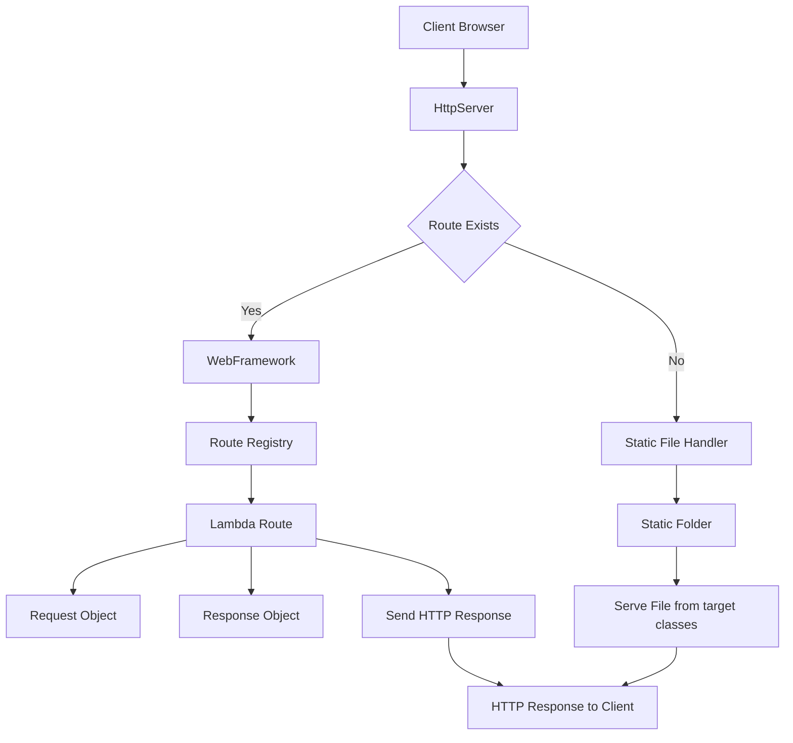

# TDSE Micro Web Framework
### Transformación Digital y Soluciones Empresariales (TDSE)

## Project Overview

This project consists of the development of a lightweight Java web framework capable of:

- Serving static files (HTML, CSS, JS, images)
- Publishing REST services using lambda expressions
- Extracting query parameters from HTTP requests
- Allowing developers to define the location of static resources

The objective is to transform an existing HTTP server into a reusable microframework that enables backend web application development.

---

## Objectives

- Implement a `get()` method to define REST services using lambda functions.
- Develop a query parameter extraction mechanism.
- Implement a `staticfiles()` method to configure static resource locations.
- Provide an example application using the framework.
- Follow professional Maven project structure.
- Include automated tests.

---

## Architecture

The framework follows a modular and layered design:




### Main Components

| Class | Responsibility |
|-------|---------------|
| `WebFramework` | Public API (get, staticfiles, start) |
| `HttpServer` | Handles HTTP connections and routing |
| `Route` | Functional interface for lambda REST handlers |
| `Request` | Parses HTTP request and query parameters |
| `Response` | Manages status and content type |
| `App` | Example application |
| `Static File Handler` | Serves static resources |

---

## How to Run the Project

### 1. Clone the repository

```bash
git clone https://github.com/SantiagoAmaya21/TDSE_Microframeworks_web.git
cd TDSE_Microframework_web
```

### 2. Build the project

```bash
mvn clean install
```

You should see:

BUILD SUCCESS

### 3. Run the example application

```bash
mvn exec:java -Dexec.mainClass="edu.eci.tdse.framework.Main"
```

Or run directly from your IDE.

The server will start on:

http://localhost:8080

## Available Endpoints
REST Services

### 1. Hello Service

http://localhost:8080/hello?name=Pedro

Response:

Hello Pedro

### 2. Pi Service

http://localhost:8080/pi

Response:

3.141592653589793

## Static Files

If staticfiles("/webroot") is configured, the framework serves:

src/main/resources/webroot/index.html

Accessible at:

http://localhost:8080/

## Automated Tests

The project includes JUnit 5 tests for:

Query parameter extraction

Route registration

Static folder configuration

Run tests with:

mvn test

Example output:

Tests run: 4, Failures: 0, Errors: 0

## Technologies Used

Java 17

Maven

JUnit 5

ServerSocket (Low-level HTTP handling)

## Project Structure

```
web-framework/
│
├── pom.xml
├── .gitignore
│
└── src
    ├── main
    │   ├── java
    │   │   └── edu/eci/tdse/framework/
    │   │
    │   │       ├── WebFramework.java
    │   │       ├── HttpServer.java
    │   │       ├── Route.java
    │   │       ├── Request.java
    │   │       ├── Response.java
    │   │       ├── StaticFileHandler.java
    │   │       └── App.java   (ejemplo de uso)
    │   │
    │   └── resources
    │       └── webroot/
    │           └── index.html
    │
    └── test
        └── java
            └── edu/eci/tdse/framework/
                ├── RequestTest.java
                └── WebFrameworkTest.java
```

## Key Technical Concepts Applied

HTTP protocol fundamentals

Client-server architecture

Functional interfaces and lambda expressions

Basic routing mechanisms

Static resource management

Maven project organization

Unit testing

## Learning Outcomes

Through this project, we gained hands-on experience in:

Designing a lightweight web framework

Understanding HTTP request parsing

Implementing routing mechanisms

Applying modular software design

Structuring enterprise-ready Java projects

This project reinforces core concepts of distributed systems and web architectures within the context of Digital Transformation and Enterprise Solutions (TDSE).
